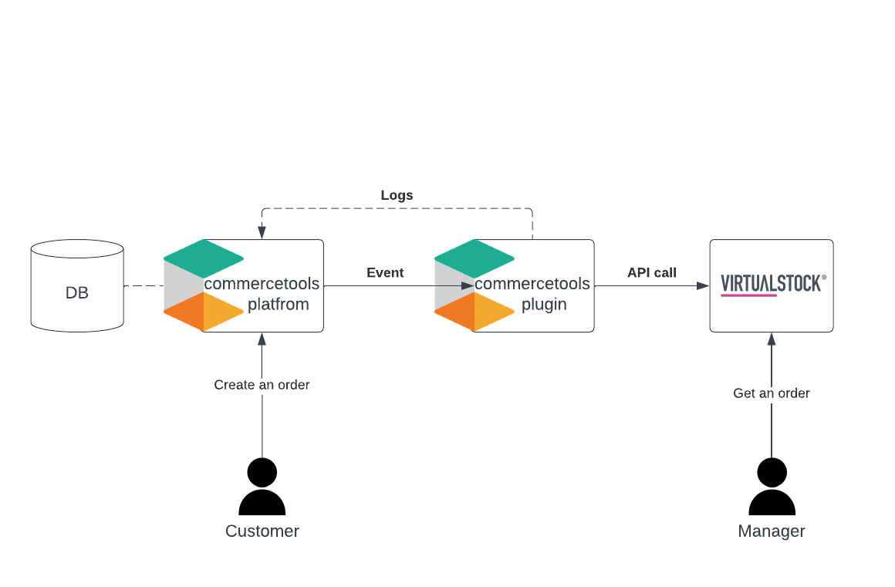
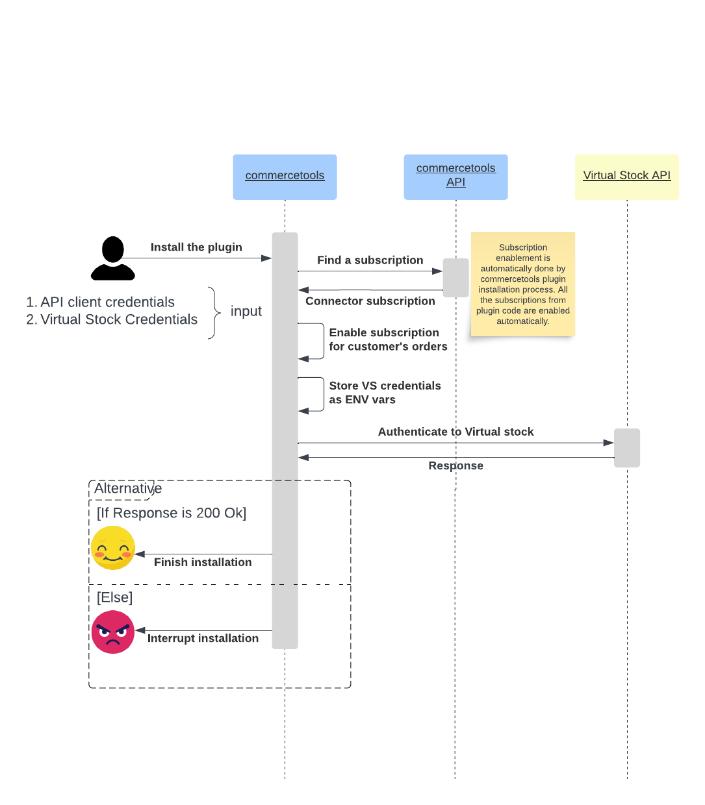
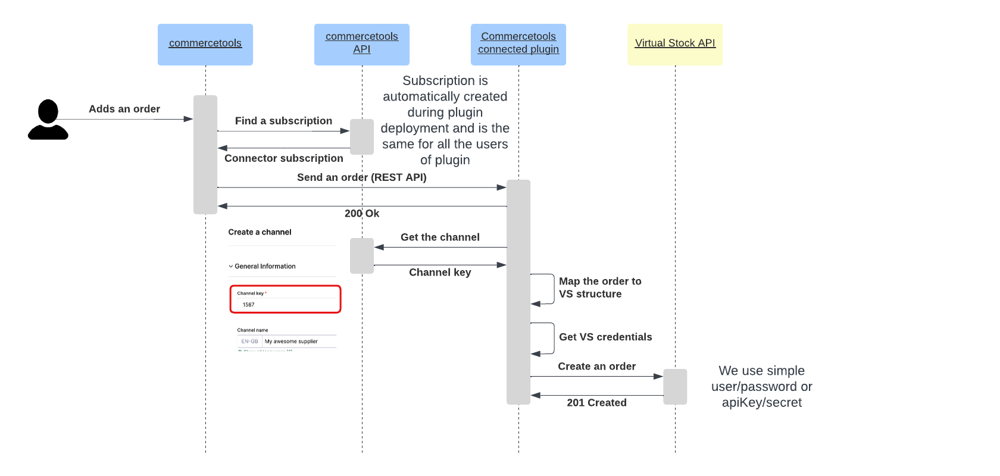
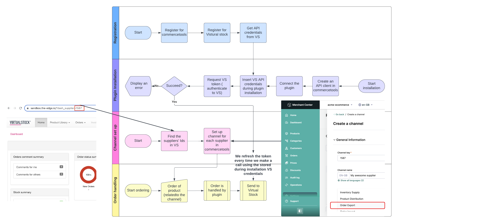

# Commercetools integration with VirtualStock Order API

This application is built as an extension to the starter template, provided by commercetools.

Please find more info on this [link](https://marketplace.commercetools.com/) and in the Instructions section below.

Please adhere to the recommendations from the Architecture principles for building a connect application section below.

## Brief introduction and purpose

This plugin's purpose is to integrate the order creation, where an order(s) created within user's Commercetools project will be automaticaly created within the Virtualstock dropship platform.
A user wiil need to have an account with Virtualstock in order to be able to use it.

## Configuration

This application should be able to run in a local environment (start:dev script) or as a plugin within the Commercetools distributed infrastructure.
To be able to run locally, please create .env file from the .env.example file and fill the appropriate values.

The first set of environment variables:

- CTP_REGION,
- CTP_CLIENT_ID,
- CTP_CLIENT_SECRET,
- CTP_PROJECT_KEY,
- CTP_SCOPE

should be obtained from the Commercetools platform once a project api is created.

The second set of environment variables

- CTP_VS_PASSWORD
- CTP_VS_USERNAME
- CTP_VIRTUALSTOCK_API_V4
- CTP_EDGE_API_V4

should be obtained by Virtualstock account holder.

## Architecture

### Component diagram

 

### Connection sequence diagram

 

### Order synchronization diagram

 

### Flow diagrams

 

## Instructions

Use `create-connect-app` cli with `starter-typescript` as `template` value to download this template repository to build the integration application, folder structure needs to be followed to ensure certification & deployment from commercetools connect team as stated [here](https://github.com/commercetools/connect-application-kit#readme)

## Architecture principles for building an connect application

- Connector solution should be lightweight in nature
- Connector solutions should follow test driven development. Unit , Integration (& E2E) tests should be included and successfully passed to be used
- No hardcoding of customer related config. If needed, values in an environment file which should not be maintained in repository
- Connector solution should be supported with detailed documentation
- Connectors should be point to point in nature, currently doesnt support any persistence capabilities apart from in memory persistence
- Connector solution should use open source technologies, although connector itself can be private for specific customer(s)
- Code should not contain console.log statements, use [the included logger](https://github.com/commercetools/merchant-center-application-kit/tree/main/packages-backend/loggers#readme) instead.
